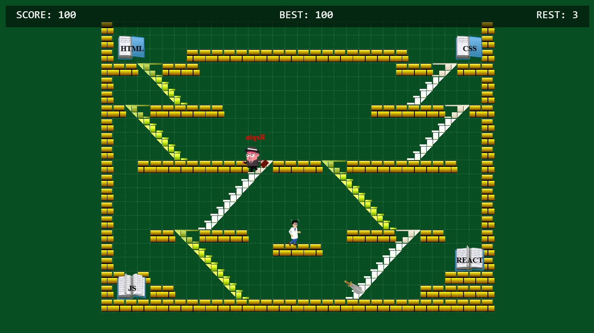

🎮 Pixel Sword Adventure
📜 Description
Pixel Sword Adventure is a 2D arcade/platformer built with JavaScript + HTML5 Canvas.
The player controls a character who can walk, jump, climb stairs, and fight with a sword.
The game world is based on a matrix map, enabling precise movement, collision detection, and object interactions.

🔑 Features
⚔️ Sword animation — weapon rotation using sprite-based animation.

🧍 Character movement — walking, jumping, falling, and climbing.

🚧 Collision system — accurate interactions with platforms and obstacles.

👾 Enemy AI — opponents move randomly, adding challenge and dynamics.

🎨 Canvas rendering — all graphics and animations are drawn in real time.

🛠 Tech Stack
JavaScript (ES6)

HTML5 Canvas

CSS3

(optional) DotLottie / sprite animations

📸 Screenshots
📸 Screenshots

